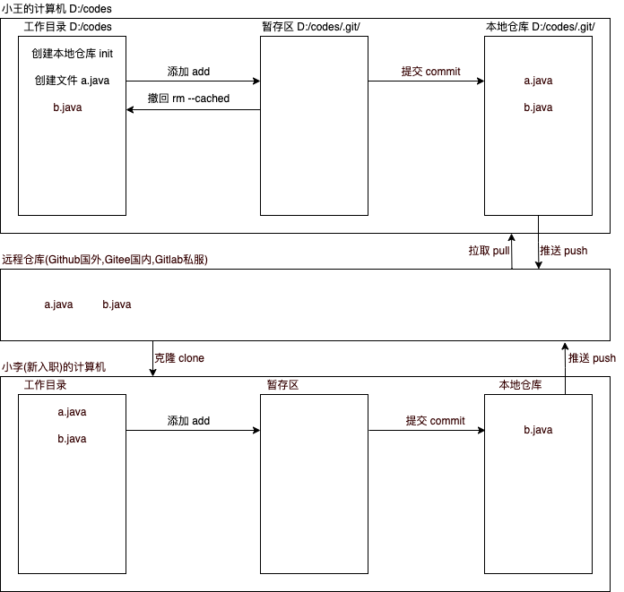

# Git

# 0. 操作流程



# 1. 基本命令

## 1.1 查看版本号信息

> 用来确定当前git及环境变量是否安装成功

```sh
# 打开cmd窗口(Windows)或者右键打开git bash here(Linux)
# Git安装成功后,会自动配置环境变量,在命令行窗口任意位置都可以执行git命令
git --version
```

## 1.2 设置全局账号信息 [了解]

> Git会将谁在什么时候,操作了什么文件或内容,忠实的记录下来
>
> 这几个命令我们在一开始进行使用,后面基本不会用到
>
> 但是如果不小心输入错了名字,再执行一次覆盖掉几颗

```sh
# 配置全局用户名称
git config --global user.name "tangseng"

# 配置全局邮箱地址
git config --global user.email "tangseng@bjpowernode.com"

# 查看全局配置信息
git config --list
```

## 1.3 创建本地仓库

> 本地仓库就是管理我们想要交给Git的文件的位置,它是一个 .git 的隐藏目录

```sh
# 创建了本地仓库后,不要在固定盘符下创建,一定要自己新建一个文件夹,在文件夹中进行执行
git init
```

## 1.4 添加到暂存区

> 将文件或文件夹添加到暂存区当中,用于提交到本地仓库时,做准备

```sh
# 将工作目录的文件添加到暂存区中(绿色)
git add 文件名称
```

## 1.5 查看文件状态

```sh
# 用于查看文件状态信息
# 状态: 未跟踪,已跟踪,已修改,已删除,已暂存...
# 用颜色来区分: 红色, 绿色
# 红色代表没有被git管理的文件,已经管理了但是又已经被修改的文件,可能刚刚创建的文件,可能是已经删除的文件...
# 绿色代表已经添加到暂存区中的文 件
git status
```

## 1.6 文件从暂存区中撤回

> 如果不小心管理错了文件,我们可以通过当前命令来撤回

```sh
# 从暂存区将它清除掉,但是不会删除本地文件
git rm --cached 文件名称
```

## 1.7 将暂存区的文件提交到本地仓库

```sh
# 将暂存区的文件提交到本地仓库中
# 提交完成后,暂存区被清空
git commit -m "日志信息"
```

## 1.8 查看日志信息

```sh
# 查看本地日志信息
git log
# 查看本地日志信息,显示在一行中
git log --oneline
# 查看历史日志信息
git reflog
```

## 1.9 版本管理

> 当版本被切换后,我们的文件中的内容也会一并的发生变化

```sh
# 可以通过该命令,切换到其他的版本中
git reset --hard 版本唯一标识
```

## 1.10 文件删除

> 如果删除的文件,已经被本地仓库管理了(执行了commit操作),那么就需要删除文件的时候,再添加到暂存区,再提交到本地仓库中,这样我们才能删除了本地文件,也删除了本地仓库中的文件

```sh
# 删除本地文件
# 1. 右键菜单选择删除
# 2. linux命令删除
# 3. 键盘上按删除键

# 文件必须是已经被git管理的文件
# 删除完成后,该文件的状态是已删除的状态(红色),执行add命令添加到暂存区,再执行commit命令,告知本地仓库当前文件已经被删除了
```

## 1.11 删除并找回文件

> 如果不小心,手抖了,删除错了,这个时候怎么办呢?
>
> 我们可以通过版本管理的方式,将它切换到没有删除的这一个版本,然后再接着操作

## 1.12 文件内容比较

> 可以比较工作目录中的文件和本地仓库中的文件的内容差异

```sh
git diff 文件名称
```

## 1.13 查看提交的文件 [了解]

```sh
# 通过查看日志的命令,可以查看到commit对象的hash值
# 最终是想要通过这个hash值,查看到我们提交的文件及文件内容的
git log

# 通过git命令,可以查看commit对象中的文件内容
git ls-tree hash值(commit)

# 通过git命令,查看blob文件中的内容
git cat-file blob hash值(blob)
```


# 2. 分支命令

> 在版本控制过程中，使用多条线同时推进多个任务就是分支管理

## 2.1 创建分支

> 基于当前分支创建的新分支,它们的代码是一致的
>
> master是我们的默认分支,我们不需要创建,这个分支就会自动产生,什么时候产生的默认分支呢?在第一次执行commit操作时,它会自动创建出来

```sh
# 基于目标分支(git status),绿色的就是当前分支
git branch 分支名称
```

## 2.2 查看分支

> 绿色标记的就是当前的分支

```sh
git branch
```

## 2.3 切换分支

> 切换分支时,请保证自己的当前分支是一个干净的工作区,没有其他的文件状态需要被管理

```sh
git checkout 分支名称
```

## 2.4 删除分支

> 创建的分支已经被修改了过,那么它和原来的分支就不一致了,所以我们要强制删除
>
> 创建的分支没有被修改过,那么我们使用普通删除就可以了

```sh
# 普通删除操作
git branch -d 分支名称

# 强制删除操作
git branch -D 分支名称
```

## 2.5 分支的合并

> 将两个分支的代码合并到一处
>
> 将目标分支的代码合并到当前分支中

```sh
git merge 目标分支
```

## 2.6 创建并切换分支

```sh
# 当前命令相当于 = git branch xxx + git checkout xxx
git checkout -b 分支名称
```

## 2.7 冲突的产生和解决

> 这里是指两个分支在合并分支时,产生的冲突问题
>
> 也可以指的是在远程多个开发者在拉取代码时,产生的冲突问题
>
> 原因: 由于多个开发者或分支,同时修改了一份文件中的相邻内容,所以导致了冲突
>
> 也就是说 git 懵了,不知道以哪个人或哪个分支为主
>
> 解决: 只需要手动进行清除标记,然后提交到本地仓库即可

```sh
<<<<<<< HEAD
qqqqqqqqqqqqqq
wwwwwwwwwwwwww
=======
aaaaaaaaaaaaaa
bbbbbbbbbbbbbb
>>>>>>> bbb
dddddddddddddd
dddddddddddddd
aaaaaaaaaaaaaa

# 清除标记,保留好我们的代码,添加到暂存区,并提交到本地仓库,这样我们就解决了这个冲突的问题了
```


# 3. 远程命令

## 3.1 注册账号

* Github
  * https://github.com
  * 服务器在国外,网络可能不稳定,英文界面
* Gitee
  * https://gitee.com
  * 服务器在国内,网络较为稳定,中文界面

## 3.2 关联远程仓库

> 将本地仓库和远程仓库,建立关联关系
>
> 关联关系建立完成后,那么我们推送时,就可以指定到我们的远程仓库来推送代码了

```sh
# 相当于在本地建立了一个键值对,账号名称是键,账号地址是值,那么我们提交的时候,指定键就可以提交到我们的远程仓库中了
git remote add 账号名称 https://gitee.com/lmx1989/yx2210.git

# 通过命令,查看建立的关联关系
git remote -v

# 我们可以建立多个关联关系,在提交代码时,可以根据账号名称,来指定提交到不同的远程仓库地址中,只不过我们不推荐这么做,因为一个本地仓库我们对应就是一个远程仓库
```

## 3.3 删除关联的远程仓库

> 相当于解除了远程仓库的关联关系了

```sh
git remote remove 账号名称
```

## 3.4 推送代码到远程仓库

> 第一次推送代码时,我们会弹出一个输入框,输入账号(邮箱地址)和密码,点击确定即可保存当前的账号信息到windows凭证中
>
> 如果不小心输入错了,那么我们删除这个windows凭证即可(gitee的账号)

```sh
# 将本地分支的代码推送到远程仓库中
git push 账号名称 本地分支名称
```

## 3.5 拉取代码到本地仓库

```sh
# 更新本地已有的分支代码
git pull 账号名称 远程分支名称

# 拉取新的分支到本地
git pull 账号名称 远程分支名称:本地分支名称
```

## 3.6 删除远程仓库

```sh
# 远程仓库的默认分支无法删除
# 如果想要删除远程仓库的默认分支,请到远程仓库的设置中进行操作清空仓库/删除仓库...
git push -d 账号名称 远程分支名称
```

## 3.7 克隆远程仓库

> 克隆远程仓库到本地目录中,克隆下来的仓库自带关联的远程关系及本地仓库 .git/

```sh
# 克隆默认的远程仓库分支
git clone 远程仓库地址

# 克隆指定的远程仓库分支
git clone -b 远程仓库地址
```